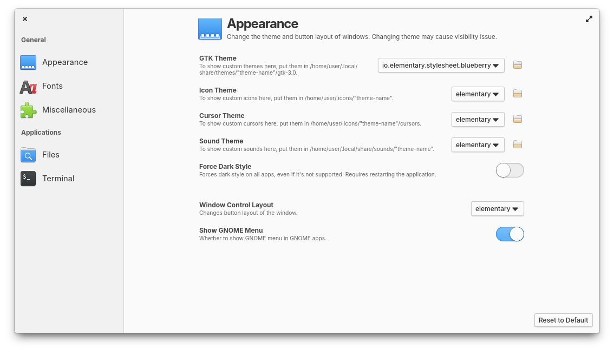

# Pantheon Tweaks
A system settings panel for the Pantheon Desktop that lets you easily and safely customise your desktop's appearance.



## Installation
Pantheon Tweaks supports the following versions of elementary OS:

  elementary OS Version | Supported?      |
  --------------------- | --------------- |
  0.4 Loki              | ❌
  5 Juno                | ❌
  5.1 Hera              | ❌
  6 Odin                | ✅
  6.1 Jólnir            | ✅
  7.0 Horus             | ✅

For users on elementary OS Hera or below, please use [elementary Tweaks](https://github.com/elementary-tweaks/elementary-tweaks) instead.

### For Users
If you have never added a PPA on your system before, you might need to run this command first:

```
sudo apt install -y software-properties-common
```

Add the PPA of Pantheon Tweaks and then install it:

```
sudo add-apt-repository -y ppa:philip.scott/pantheon-tweaks
sudo apt install -y pantheon-tweaks
```

Open System Settings and there should be a new Plug named "Tweaks".

### For Developers
If you would contribute to the project and want to install Pantheon Tweaks from source code, clone this repository and then run the following commands:

```
sudo apt install -y elementary-sdk
meson setup builddir --prefix=/usr
ninja -C builddir
ninja install -C builddir
```

Open System Settings and there should be a new Plug named "Tweaks".

## Special Thanks
This repository is a fork of the [original elementary-tweaks](https://launchpad.net/elementary-tweaks) and could not have been done without the work of its [authors](AUTHORS) Michael P. Starkweather, Michael "Versable" Langfermann, PerfectCarl, Marvin Beckers and additional [contributors](CONTRIBUTORS).
