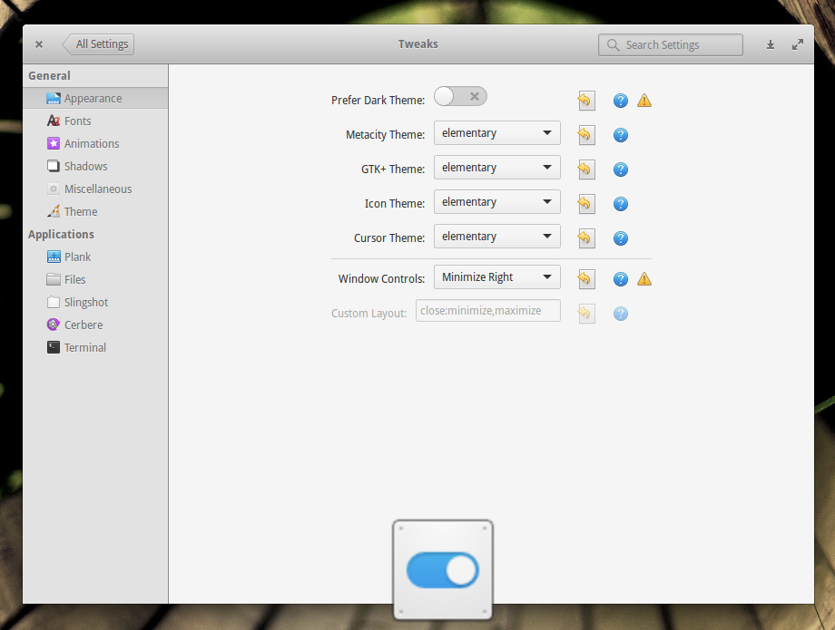

# elementary-tweaks
elementary-tweaks is a system settings component for elementary OS that lets you easily customise the desktop's appearance.

This repository is a fork of the [original elementary-tweaks](https://launchpad.net/elementary-tweaks) and could not have been done without the work of its [authors](AUTHORS) Michael P. Starkweather, Michael "Versable", PerfectCarl and additional [contributors](CONTRIBUTORS).

## Development
* [Guidelines for contributing](CONTRIBUTING.md)
* [Changelog](CHANGELOG.md)
