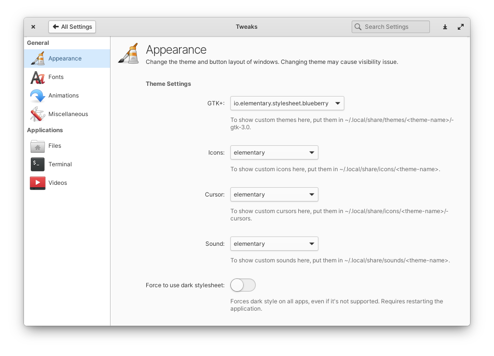

# Pantheon Tweaks
A system settings panel for the Pantheon Desktop and elementary OS **6.0** that lets you easily and safely customise your desktop's appearance 



## Installation

Coming Soon... 

### How to build
```
sudo apt install libgconf2-dev libpolkit-gobject-1-dev libswitchboard-2.0-dev elementary-sdk
meson build --prefix=/usr
cd build
ninja

sudo ninja install
io.elementary.switchboard
```

### Special Thanks
This repository is a fork of the [original elementary-tweaks](https://launchpad.net/elementary-tweaks) and could not have been done without the work of its [authors](AUTHORS) Michael P. Starkweather, Michael "Versable" Langfermann, PerfectCarl, Marvin Beckers and additional [contributors](CONTRIBUTORS).

